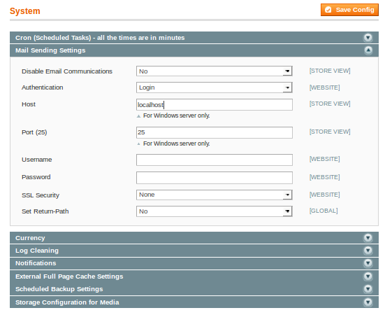

Smtp Mail Authentication
======================

Magento: Smtp mail authentication

SMTP Mail Authentication extension supports all SMTP servers by providing SSL Authentication

# Installation

Magento CE 1.7+

* Download latest version [https://github.com/kalpeshbalar/magento-smtp.git]
* Unzip in Magento root folder
* Clean cache

## Usage

* Go to System > Configuration > System (Advanced) > Mail Sending Settings

